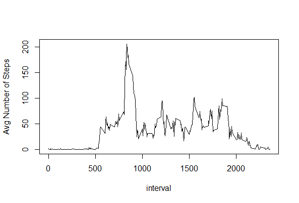
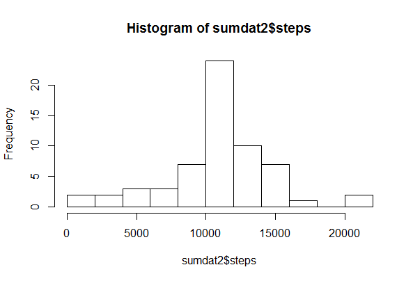

Reproducible Research: Peer Assessment 1
==============================================================


## Loading and preprocessing the data


Download and place the the data file in your local R directory. Then read the data into a dataframe.

```{R}
df <- read.csv("activity.csv")

```


## What is mean total number of steps taken per day?

The mean number of steps was 10766 per day. The median is 10765.

```{R}
library(dplyr)
stepSum <- group_by(df,date)
sumdat <- summarize_all(stepSum,sum)
summary(sumdat$steps)
```

Here is a distribution of the total number of steps taken in all days.

```{R}
hist(sumdat$steps,breaks = 10)
```

 


## What is the average daily activity pattern?


```{R}
daily <- df %>%
group_by(interval) %>%
  summarize(mstep = mean(steps,na.rm=TRUE))
plot(daily,type = "l", ylab = "Avg Number of Steps")
```




5 minute interval with maximum number of steps is 08:35.


```{R}
daily$interval[daily$mstep == max(daily$mstep)]
```


## Imputing missing values


First we examine how the NA's are distributed. It turns out that they are confined to particular days. And those days have NA's for each interval value.

```{R}
nadf <- df[is.na(df$steps),]
nasum <- group_by(nadf,date)
count(nasum,steps)
```

We can choose to replace the NA's with their average value for each time interval.

```{R}
repvals <- daily$mstep
```


Then we will define a new dataframe for replacing the NA's and replace all NA's with thier replacement values.

```{R}
newdf <- df
newdf$steps[is.na(newdf$steps)] <- repvals
```

Then we will recalculate the mean and the distribution of total steps by day. The mean value did not change, and the median rose to 10766. By imputing additional mean values we effectively narrowed the distribution and made it more normal.

```{R}
stepSum2 <- group_by(newdf,date)
sumdat2 <- summarize_all(stepSum2,sum)
summary(sumdat2$steps)
```


The distribution is similar, but since we effectively added more mean values is it narrower.

```{R}
hist(sumdat2$steps,breaks = 10)
```

 

## Are there differences in activity patterns between weekdays and weekends?
