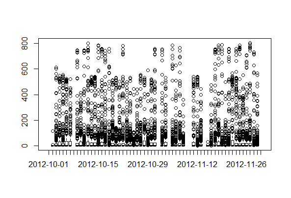

#Reproducible Research: Peer Assessment 1
==============================================================


## Loading and preprocessing the data

```{R}
df <- read.csv("activity.csv")

```

## Test Plot

 


## What is mean total number of steps taken per day?


## What is the average daily activity pattern?


## Imputing missing values


## Are there differences in activity patterns between weekdays and weekends?
