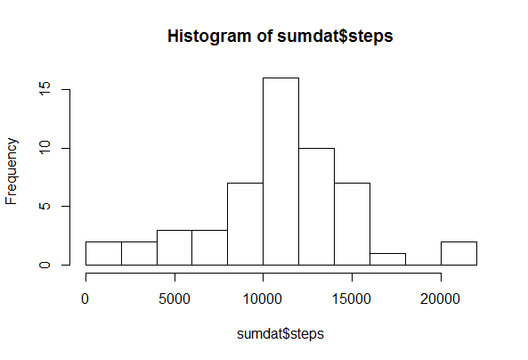

Reproducible Research: Peer Assessment 1
==============================================================


## Loading and preprocessing the data


Download and place the the data file in your local R directory. Then read the data into a dataframe.

```{R}
df <- read.csv("activity.csv")

```


## What is mean total number of steps taken per day?


```{R}
stepSum <- group_by(df,date)
sumdat <- summarize_all(stepSum,sum)
summary(sumdat$steps)
```

Here is a distribution of the total number of steps taken in all days.

```{R}
hist(sumdat$steps,breaks = 10)
```

 


## What is the average daily activity pattern?


## Imputing missing values


## Are there differences in activity patterns between weekdays and weekends?
